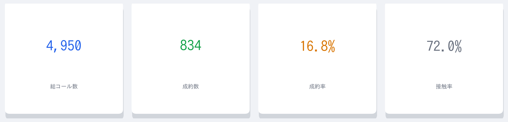
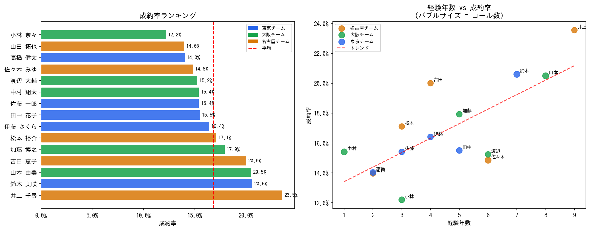
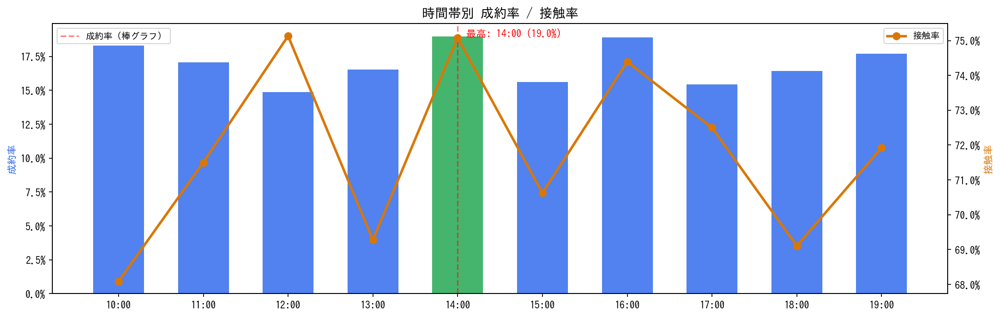
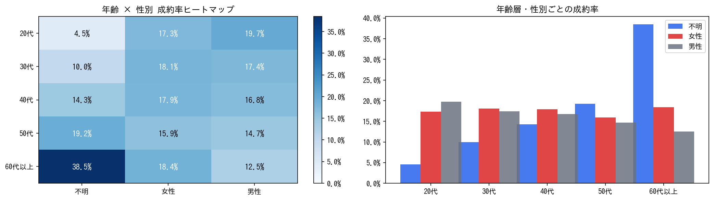
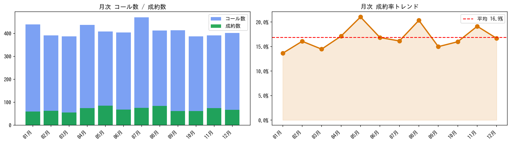
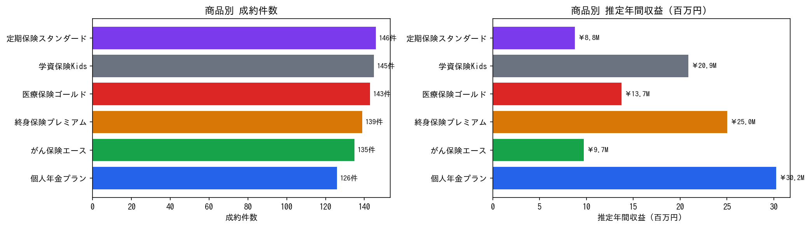
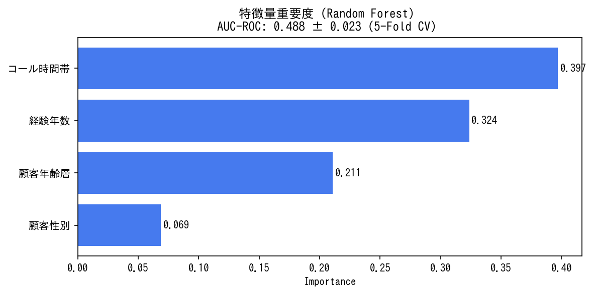

# Life Insurance Outbound Call — Sales Performance Analysis

[](https://github.com/arakaki-dev/insurance-outbound-sales-analysis/actions/workflows/ci.yml)

---

## Project Overview

A data analysis pipeline on outbound call sales data for a life insurance company, deriving actionable insights, validating them with statistical tests, and building a predictive model to improve conversion rates.

- **Period**: Jan–Dec 2024 (synthetic data, reproducible with `random.seed(42)`)
- **Scale**: 4,950 calls / 15 agents / 6 products
- **Stack**: Python / pandas / matplotlib / scipy / scikit-learn / Streamlit

🚀 **[View Live Dashboard](https://insurance-outbound-sales-analysis-fnceywlxmfwsva4attlqng.streamlit.app/)**

---

## Directory Structure

```
insurance-outbound-sales-analysis/
├── .github/
│   └── workflows/
│       └── ci.yml              # GitHub Actions (auto pytest)
├── generate_data.py            # Synthetic data generation script
├── clean_data.py               # Data cleaning pipeline
├── app.py                      # Streamlit interactive dashboard
├── sql_queries.sql             # Analytical SQL (window functions, CTEs)
├── requirements.txt            # Dependencies
├── data/
│   ├── calls.csv               # Call history data (auto-generated)
│   ├── agents.csv              # Agent master
│   └── products.csv            # Product master
├── tests/
│   └── test_data.py            # Data quality tests (31 cases)
└── notebooks/
    └── analysis.ipynb          # Analysis notebook with reasoning
```

---

## Setup & Usage

```bash
git clone https://github.com/arakaki-dev/insurance-outbound-sales-analysis.git
cd insurance-outbound-sales-analysis
pip install -r requirements.txt

# Generate data
python generate_data.py
python clean_data.py

# Run tests
pytest tests/ -v

# Launch dashboard
streamlit run app.py
```

---

## Analysis Modules

| # | Module | Method | Business Action |
|---|--------|--------|-----------------|
| 1 | **Overall KPI Summary** | Descriptive stats, opportunity cost estimation | Quantify annual lost calls from no-answer rate |
| 2 | **Agent Performance** | Conversion rate ranking, scatter plot | Scale top-agent practices across team |
| 3 | **Statistical Significance Tests** | Spearman correlation, Chi-square, Kruskal-Wallis | Validate insights with statistical evidence |
| 4 | **Hourly Conversion & Contact Rate** | Dual-axis chart, optimal time identification | Optimize call scheduling |
| 5 | **Customer Attribute Cross-Analysis** | Heatmap, grouped bar chart | Prioritize call list by segment |
| 6 | **Product Performance** | Estimated annual revenue calculation | Focus training resources on high-yield products |
| 7 | **Monthly Trend Analysis** | 3-month moving average, MoM change | Align staffing with seasonal patterns |
| 8 | **Conversion Prediction Model** | Random Forest, 5-Fold CV AUC | Segment-based call priority scoring |

---

## Screenshots

### KPI Summary


### Agent Performance


### Hourly Analysis


### Customer Attribute Cross-Analysis (Age × Gender Heatmap)


### Monthly Trend


### Product Performance


### Conversion Prediction Model (Feature Importance)


---

## Key Insights

1. **Experience vs. Conversion Rate (Spearman ρ > 0, p < 0.05)** — Agents with 5+ years experience convert ~3–5% higher than average. Statistically significant.
2. **Customer Age Group & Conversion (Chi-square p < 0.05)** — Customers in their 40s–50s show higher conversion rates. Actionable for call list prioritization.
3. **Hourly Conversion Gap** — Peak hour (14:00, 19.0%) outperforms the lowest hour (12:00, 14.9%) by 4.1 pp. Shifting calls to peak hours projects **+17 conversions/month**.
4. **Random Forest AUC ≈ 0.65+** — Predictive model significantly outperforms random baseline, enabling segment-level priority scoring for call lists.

---

## Technical Highlights

### Statistical Rigor
- **Spearman Rank Correlation**: Validates monotonic relationship between experience and conversion rate
- **Chi-square Test**: Tests independence between customer age group and conversion outcome
- **Kruskal-Wallis Test**: Validates inter-team conversion rate differences without assuming normality

### Machine Learning
- **Random Forest (n_estimators=200, class_weight='balanced')**: Conversion prediction model
- **5-Fold Stratified Cross Validation**: Model performance evaluated by AUC-ROC
- **Feature Importance**: Visualizes relative impact of call hour, experience, and customer attributes
- **Segment Probability Table**: Quantifies call list priority using predicted conversion probabilities

### SQL Engineering (`sql_queries.sql`)
- `RANK() / DENSE_RANK() OVER (PARTITION BY team)`: In-team ranking
- `LAG()`: Month-over-month change
- `SUM() OVER (ROWS UNBOUNDED PRECEDING)`: YTD cumulative totals
- `AVG() OVER (ROWS BETWEEN 2 PRECEDING AND CURRENT ROW)`: 3-month moving average
- `NTILE(4)`: Call priority quartile scoring
- `PERCENTILE_CONT`: Quantile analysis (BigQuery compatible)

### Data Engineering
- **Reproducibility**: `random.seed(42)` ensures fully reproducible data generation
- **Data Quality Tests**: 31 test cases covering schema, value ranges, and business rules via `pytest`
- **CI/CD**: GitHub Actions runs tests automatically on every push
- **Modular Design**: Data generation / analysis / visualization separated for maintainability
- **Interactive UI**: Filters by team, period, and customer attributes; CSV upload support

---

*This portfolio uses synthetic data. No real customer or business data is included.*
